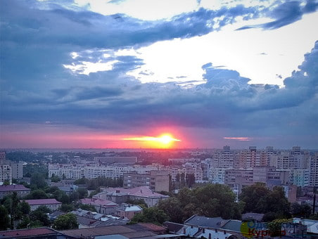
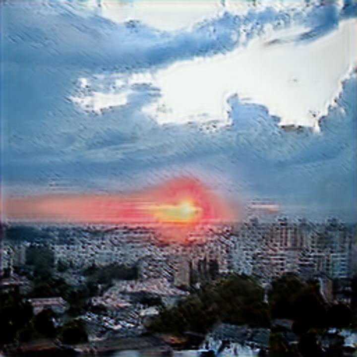
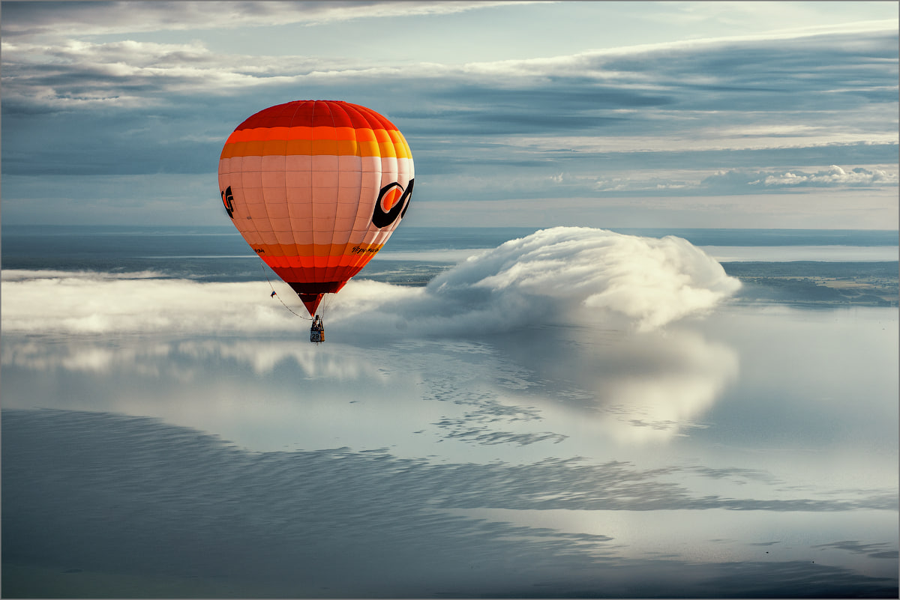
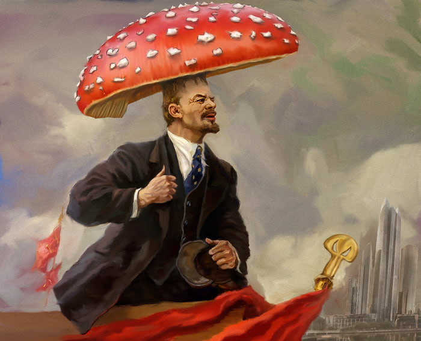
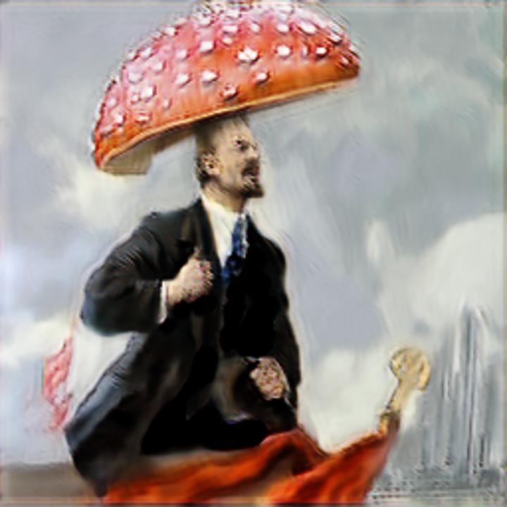
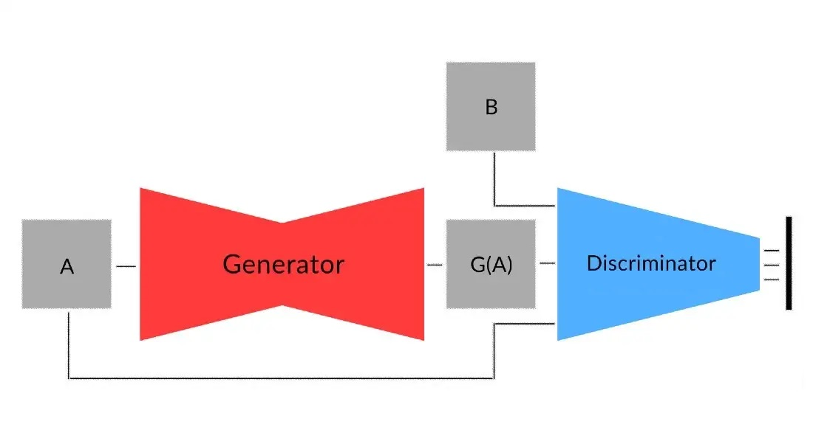

# DC_GAN_Style_Transferer

Этот репозиторий содержит код для реализации переноса стиля изображений с одних картинок на другие (Neural Style Transfer) в телеграм боте. 

Переносился стиль рисовки из аниме "Унесённые призраками" Хаяо Миядзаки. Для подготовки датасета была получена секвенция (покадровое разбиение) всего фильма и выбрано случайным образом 2000 фотографий. Для датасета из домена "обычных" фото были взяты датасет случайных фотографий с сайте Kaggle.

    
    
    

    

    
    

## Модель

Модель представляет из себя Deep Convolutional Generative Adversarial Network (DC GAN).

    
    

Дискриминатор состоит из последовательных convolution слоёв с батч-нормализацией и функцией активации Leaky-ReLU

Генератор также содержит последовательные convolution слои с батч-нормализацией, но помимо этого также есть transposed convolution слои для восстановления размерности картинки.

## Обучение

В качестве потери был выбрана классическая среднеквадратичная ошибка (MSE Loss), а в качестве оптимизатора AdaM. Обучалась модель на 78 эпохах (~6 часов).

Для удобного использования модель была импортирована в телеграм бот (с помощью библиотеки ONNX), который запущен на облачном сервисе [Python anywhere](https://www.pythonanywhere.com/).

## Визуализация работы 

Видео работы можно найти [здесь](https://youtu.be/K6HXEHmGjb4)

По вопросам работы бота можно писать в [телеграм](https://t.me/awwShitHereWeGoAgain).
